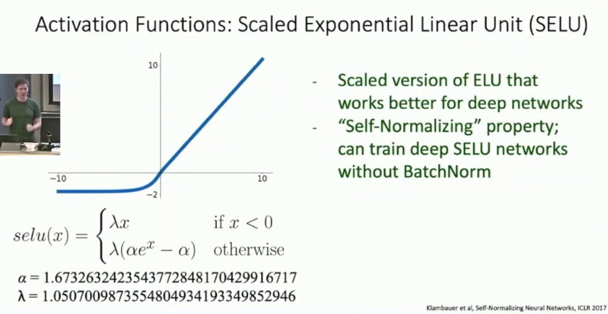
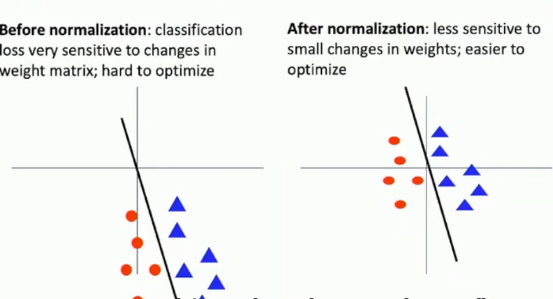
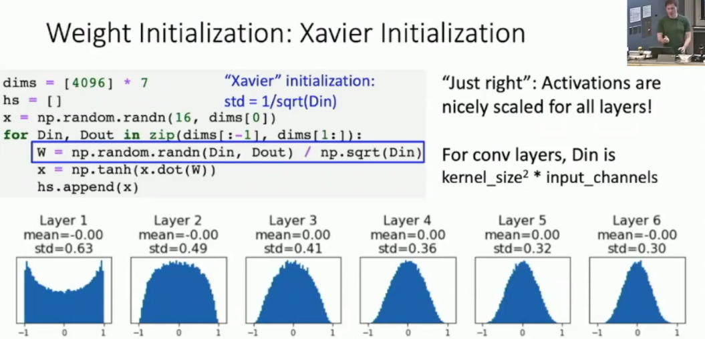
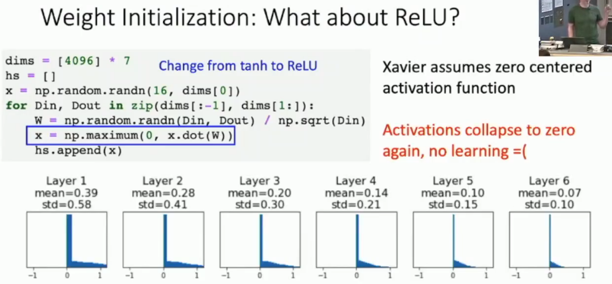
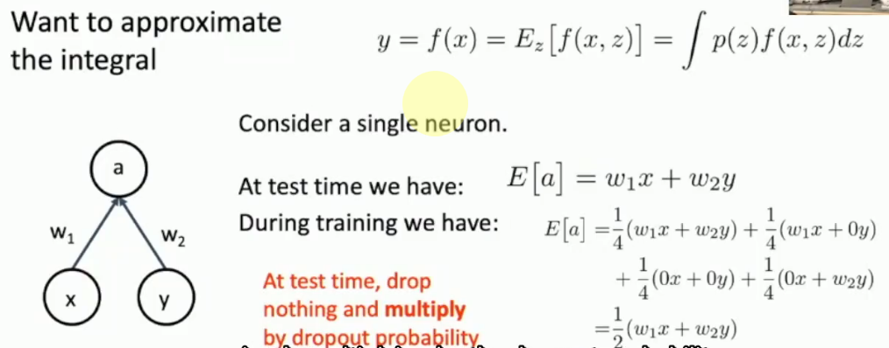
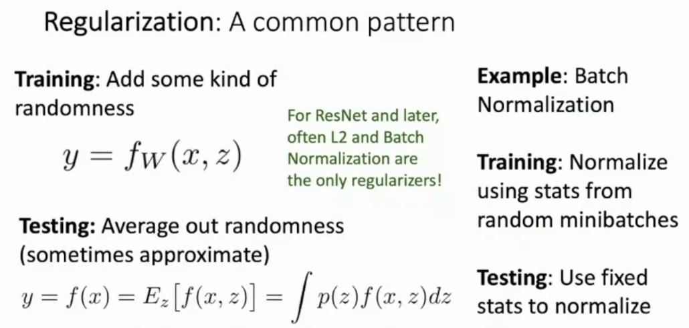
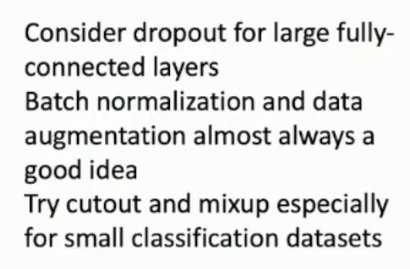

+++
title = 'L10-Training I'
date = 2024-11-04T09:46:08+08:00
draft = false
categories = ['UMich-EECS-498']
+++
# Training I


## Activation Functions
- Sigmoid function: $\sigma(x) = \frac{1}{1 + e^{-x}}$
  - 不是0中心
  - 两端饱和
  - always all positive or negative :(
  - exp() 计算复杂，但是对于GPU不是问题
- tanh function: $\tanh(x) = \frac{e^x - e^{-x}}{e^x + e^{-x}}$
  - sigmoid变体
- ReLU function: $f(x) = max(0, x)$
  - 不会饱和
  - 计算快
  - 非0中心
  - dead relu ==> leaky relu
- Leaky ReLU function: $f(x) = max(0.01x, x)$
  - 解决了dead relu问题
  - ==> PRelu function：把0.01改成可学习的参数
- ELU function: $f(x) = \begin{cases} x & x \geq 0 \\ \alpha(e^x - 1) & x < 0 \end{cases}$




## Data Preprocessing

参见DATA-100相关课程


敏感性问题



## Weight Initialization
参考cmu 10414课程notes HW3左右部分




or MSRA （MicroSoft Research Asia）

## Regularization
L1/L2 regularization略，DATA-100相关课程
### Dropout
NNDL的观点也有讲到
- 随机性
- 子模型叠加

Test Time激活所有的神经元，用一个缩放因子 $p$ 处理，或者inverting dropout mask



BN和dropout看起来似乎一样


## Augmentation
```python
import torchvision.transforms as transforms

transform_train = transforms.Compose([
    transforms.RandomCrop(32, padding=4),
    transforms.RandomHorizontalFlip(),    
    transforms.ToTensor(),
    transforms.Normalize((0.4914, 0.4822, 0.4465), (0.2023, 0.1994, 0.2010)),
])
```

以及其他的一些数据增强方法，来自ECCV ICLR等





