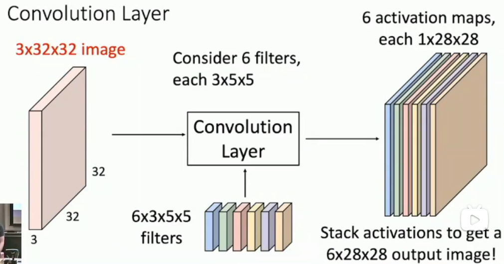
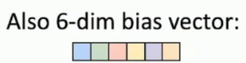
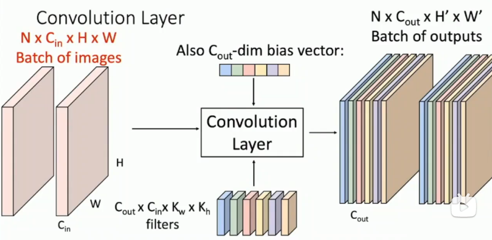

# Convolutional Neural Networks

## Components of a CNN

- Convolutional layers
- Pooling layers
- Normalization layers

## Convolutional Layers

注意到一个通道的卷积核也是全通道数 **3** x5x5

偏置是一个向量

(b, c, h, w)表示batch size, channel, height, width!
