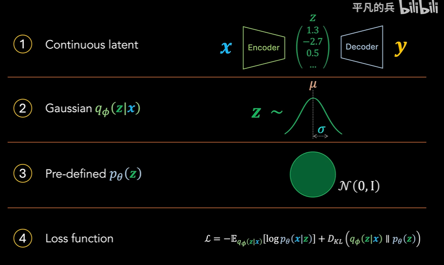
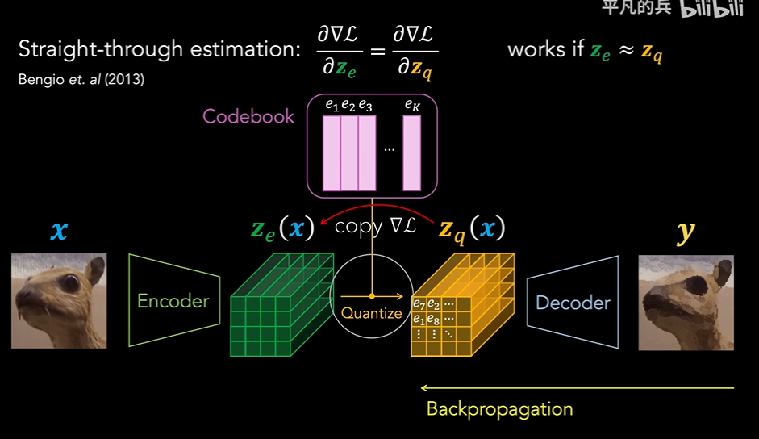
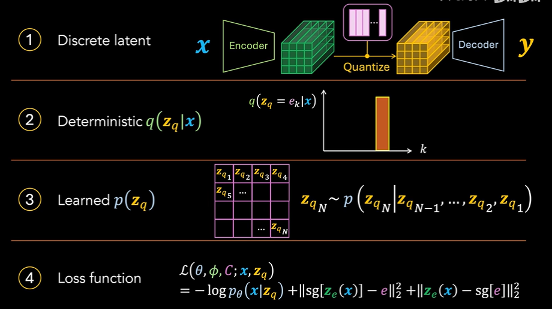

# VQVAE

Neural Discrete Representation Learning 2017 google

## how to quantize?

- traditionally, a VAE has 4 components
  - continuous latent space
  - Gaussian $q_\phi(z|x)$
  - pre-defined $p_\theta(z)$
  - loss function

As for the VQVAE

1. discrete latent space/code book

- introduce a code book $K \times D$ where $K$ is the number of codewords and $D$ is the dimension of each codeword
- each $z_e(x)$ is replaced by a nearest vector $e_i$ in codebook, then $z_e(x) \Rarr z_q(x)$; for nn, $z_q(x) = e_k \text{ where } k =  \arg\min_k ||z_q(x) - e_k||_2$
- then discrete latent space is fed into decoder

2. no more Gaussian sampling, $q_\phi(z|x)$ is *deterministic*,

as for the posterior, we use a categorical distribution
$$
z_q(x) \sim q(e_k|x) \\\\
q(z_q = e_k|x) = \begin{cases} 1 & k = \argmin_j||z_e(x) - e_j|| \\ 0 & \text{else} \end{cases}
$$

as for the *prior / training*, we use *fixed* uniform distribution, sometimes not uniform, but fixed
$$
p(z_q = e_k) = \frac{1}{K}
$$

then we can calculate the KL divergence

recall that former is *posterior*, latter is *prior*

$$
\begin{aligned}
D_{KL}(q(z_q|x) || p(z_q)) &= \sum_k q(z_q|x) \log \frac{q(z_q|x)}{p(z_q)} \\
&= \sum_k q(z_q = e_k|x) \log \frac{q(z_q = e_k|x)}{p(z_q = e_k)} \\
&= \sum_k q(z_q = e_k|x)( \log q(z_q = e_k|x) - \log p(z_q = e_k))\\
&=  - \sum_k q(z_q = e_k|x) \log p(z_q = e_k) \quad \text{either 0 or 1}\\
&= \log K
\end{aligned}
$$

during the training, we may not want to let the prior distribution be uniform, so introduce a secondary AR model to learn the prior distribution

3. loss function
- reconstruction loss's backprop: Straight-through estimator

- but what about codebook learning?

$$
\mathcal{L_{codebook}} = ||\text{sg}[z_e(x)] - e||_2^2
$$
make sure that $z_e \approx z_q$
- to avoid fluctuation and "arbitrary growth" of encodings, we use a commitment loss, pulling the encodings back to our codebook world
$$
\mathcal{L_{commit}} = ||z_e(x) - \text{sg}[e(x)]||_2^2
$$

## benefits of VQVAE
- some modality is represented as a discrete form
- data compression, do not hope to in space like $\R^n$
- tokenization friendly, transformer friendly, good for language modeling

