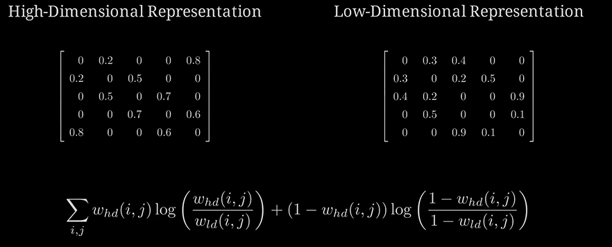

# t-SNE and UMAP

## t-SNE
- t-distributed Stochastic Neighbor Embedding (t-SNE) 
- introduced t-distribution to replace Gaussian distribution!
- the bigger the perplexity, the slower the algorithm
### SNE

> points in high-dimensional space that are close to each other should be close in low-dimensional space too

how to measure the distance between two points in high-dimensional space?

- calculate the distance between the points using a distance metric:  $p_{0,j} = e^{-\frac{\|x_0 - x_j\|^2}{ 2\sigma_0^2}}$,the **perplexity** is the hyperparameter $\sigma_0$ that controls the effective number of neighboring points used in the computation of the probability distribution.

then we normalize the probability distribution to make it sum up to 1: $p_{i,j} = \frac{p_{i,j}}{\sum_{k\neq i}p_{i,k}}$

- in lower dimensional space, we use the same thing, finding a distribution of distances between the points

$$
q_{i,j} = \frac{p_{i,j}}{\sum_{k\neq i}p_{i,k}}, \quad \text{where} \quad p_{i,j} = e^{-||y_i - y_j||^2}
$$

- then we can bring the two distributions closer by minimizing the Kullback-Leibler divergence between them :yum:

loss function, w.r.t. $y_i$ :
$$
\frac{\partial D_{KL}(P||Q)}{\partial y_i}
$$

- as for the perplexity, we tend to choose :

$$
\sigma_0 = 2^{-\sum_{j \neq i} p_{i,j} \log_2 p_{i,j}}
$$

Theoretically, the perplexity should represent the # of other points that a given point will consider as neighbors. $\sigma_0 \uparrow$, more diffused!

## UMAP
> Uniform Manifold Approximation and Projection (UMAP), use graph instead of distance distribution

- KNN graph construction, for each point: 
$$
v_{i,j} = e^{-\frac{\max(0, d(x_i, x_j) - \rho_i)}{\sigma_i}}, \quad \text{where} \quad \rho_i = \text{distance to the nearest neighbor}
$$

- no nomalization needed, combine the graph!
$$
w_{i,j} = v_{i,j} + v_{j,i} - v_{i,j}v_{j,i}
$$

- do the same thing in the low-dimensional space

- minimize the distance between the high-dimensional points and the low-dimensional points, using the adjacency matrix

